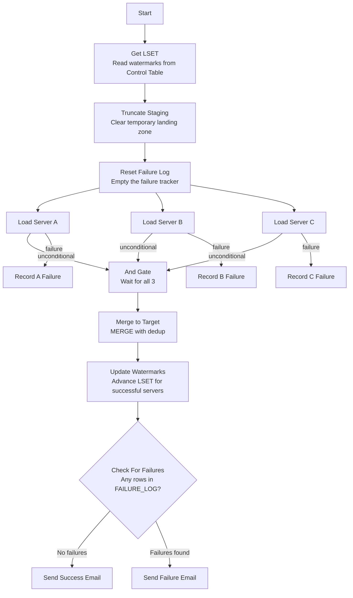

# Multi-Server Extract & Load Pipeline

## What Does This Pipeline Do?

Imagine you have 3 database servers running scheduled jobs (like backups, data imports, report generation). Each server keeps a log of when those jobs ran and whether they succeeded or failed. This pipeline reaches into all 3 servers, pulls that job history data, and loads it into a single Snowflake table where you can query everything in one place.

The tricky part? Sometimes one server might be down or have a password issue. This pipeline handles that gracefully — it still loads data from the servers that ARE working and tells you which ones failed.

## Real-World Use Case

A company runs SQL Server Agent jobs across multiple production servers for things like:
- Nightly data warehouse refreshes
- Hourly report generation
- Database maintenance (backups, index rebuilds)

The DBA team needs a single dashboard showing job execution history across ALL servers. Instead of logging into each server manually, this pipeline consolidates everything into Snowflake automatically on a daily schedule.

## Prerequisites (What You Need Before Running)

1. **Snowflake account** with a database and schema (e.g., `MY_DATABASE.ETL`)
2. **SQL Server access** — credentials for each source server
3. **These tables created in Snowflake:**
   - `EXTRACT_STAGE` — temporary landing zone (pipeline truncates this each run)
   - `JOB_RUN_HISTORY` — final deduplicated target table
   - `CONTROL_TABLE` — stores the "last successful timestamp" per server
   - `FAILURE_LOG` — tracks which servers failed (recreated each run)
4. **Project variables configured:**
   - `v_database` — your Snowflake database name
   - `v_server_ip_a`, `v_server_ip_b`, `v_server_ip_c` — server connection strings
   - `v_sql_username_a/b/c` and `v_sql_password_a/b/c` — credentials
   - `v_source_name_a/b/c` — human-readable server names
   - `v_email_recipients` — who gets notified
   - `v_smtp_hostname` — your email relay server

## How It Works — Step by Step

### Step 1: Get LSET (Last Successful Extraction Timestamp)

Before pulling data, we need to know: "Where did I leave off last time?"

The pipeline reads the `CONTROL_TABLE` to get the last successful timestamp for each server. If it's the first run ever, it defaults to `1900-01-01` (meaning "get everything").

**Why this matters:** Without this, you'd re-extract ALL historical data every single run. With watermarking, you only get NEW records since the last successful pull. This is called "incremental extraction."

### Step 2: Truncate Staging

The staging table (`EXTRACT_STAGE`) is a temporary landing zone. We wipe it clean before each run so we're working with a fresh slate. This makes the pipeline "idempotent" — you can safely re-run it without duplicating data.

### Step 3: Reset Failure Log

We recreate the `FAILURE_LOG` table (empty) before each run. This table will capture any server that fails during extraction. By recreating it, we ensure no stale data from previous runs confuses the failure detection.

### Step 4: Load Server A / B / C (Runs in Parallel)

This is the main extraction. All 3 servers are queried simultaneously (parallel execution). Each one:

1. Connects to the SQL Server using JDBC
2. Runs a query against `msdb.dbo.sysjobhistory` (the system table that stores job run logs)
3. Filters records WHERE the run timestamp is greater than the LSET (only new records)
4. Loads results into the `EXTRACT_STAGE` table in Snowflake

**What happens on failure:** If a server is unreachable (wrong password, network issue), the `failure` transition fires a "Record Failure" component that logs which server failed into `FAILURE_LOG`. The `unconditional` transition still fires to the And gate — so the pipeline continues regardless.

### Step 5: And Gate (Wait for All 3)

The And component waits until ALL 3 parallel loads have completed (whether they succeeded or failed). Once all 3 finish, it releases the pipeline to continue.

**Key detail:** The And gate receives `unconditional` signals. "Unconditional" means it fires no matter what — success or failure. So the And always gets exactly 3 signals.

### Step 6: Merge to Target (Deduplication)

Now we MERGE the staged data into the final target table (`JOB_RUN_HISTORY`). The MERGE uses a composite key:
- `RUN_DATETIME` + `SOURCE_SERVER` + `JOB_ID` + `STEP_ID`

If a record already exists (same key), we skip it. If it's new, we insert it. This prevents duplicates even if you accidentally run the pipeline twice.

### Step 7: Update Watermarks

For each server that successfully loaded rows, we advance its watermark in `CONTROL_TABLE` to `CURRENT_TIMESTAMP()`. Servers that failed (0 rows in staging) keep their old watermark — so their data will be re-attempted next run.

### Step 8: Check For Failures

This is the branching logic. We query `FAILURE_LOG`:
- If it's **empty** → all servers succeeded → route to success email
- If it has **rows** → at least one server failed → route to failure email

The branching uses a deliberate division-by-zero trick: if `COUNT(*) > 0`, the SQL evaluates `1/0` which causes an error, triggering the component's failure transition.

### Step 9: Send Email

Either a success or failure notification email is sent to the configured recipients.

## Pipeline Flow



## Key Concepts Explained

### What is LSET/CET Watermarking?

- **LSET** = Last Successful Extraction Timestamp. The timestamp of when data was last successfully pulled.
- **CET** = Current Extraction Timestamp. The timestamp of the current run.

Think of it like a bookmark. Each time you successfully read a book (extract data), you move your bookmark forward. Next time, you start reading from where you left off.

### What is an And Gate?

In Matillion, an And component collects signals from multiple parallel branches. It only releases (continues the pipeline) once ALL expected inputs have arrived. It's like waiting at a meeting until everyone shows up.

### What does "Unconditional" mean?

In Matillion, components have 3 types of output transitions:
- **Success** (green) — fires only if the component succeeds
- **Failure** (red) — fires only if the component fails
- **Unconditional** (gray) — fires ALWAYS, regardless of outcome

We use unconditional for the And gate so it always gets its signals. We use failure for the Record components so they only fire when something goes wrong.

### What is MERGE?

A SQL MERGE statement compares source data against a target table using a key. For each row:
- If the key exists in target → skip (or update)
- If the key doesn't exist → insert

This prevents duplicates and makes the pipeline safe to re-run.

### What is Idempotency?

A pipeline is "idempotent" if running it multiple times produces the same result as running it once. Our pipeline achieves this through:
1. TRUNCATE staging (clean slate each run)
2. MERGE to target (no duplicates)
3. Watermark only advances on success

## Troubleshooting

| Symptom | Cause | Fix |
|---------|-------|-----|
| Pipeline hangs at And gate | A Load component didn't fire unconditional | Check that transitions say `unconditional`, not `success` |
| Same data loaded every run | Watermark not advancing | Check `CONTROL_TABLE` — does LSET update after successful runs? |
| All servers show as failed | Credentials/network issue | Verify connection strings and passwords in project variables |
| Duplicates in target table | MERGE key doesn't match | Ensure composite key covers all uniqueness columns |
| Success email sent despite failure | Failure log is empty | Check Record Failure components have correct INSERT SQL |

## Table Schemas

```sql
-- Staging table (temporary, truncated each run)
CREATE TABLE ETL.EXTRACT_STAGE (
    RUN_DATETIME TIMESTAMP,
    STEP_ID NUMBER,
    SOURCE_SERVER STRING,
    JOB_ID STRING,
    JOB_NAME STRING,
    STEP_NAME STRING,
    EXEC_STATUS STRING,
    MESSAGE STRING,
    DURATION_SECONDS NUMBER,
    EXTRACTED_AT TIMESTAMP
);

-- Target table (permanent, deduplicated)
CREATE TABLE ETL.JOB_RUN_HISTORY (
    RUN_DATETIME TIMESTAMP,
    STEP_ID NUMBER,
    SOURCE_SERVER STRING,
    JOB_ID STRING,
    JOB_NAME STRING,
    STEP_NAME STRING,
    EXEC_STATUS STRING,
    MESSAGE STRING,
    DURATION_SECONDS NUMBER,
    EXTRACTED_AT TIMESTAMP
);

-- Watermark tracking
CREATE TABLE ETL.CONTROL_TABLE (
    PIPELINE_NAME STRING,
    SOURCE_KEY STRING,
    LAST_SUCCESS_TIMESTAMP TIMESTAMP
);

-- Runtime failure capture
CREATE TABLE ETL.FAILURE_LOG (
    SOURCE_KEY STRING,
    SOURCE_NAME STRING,
    FAILED_AT TIMESTAMP
);
```
